<!-- <div align="center">


<br/>

[](https://github.com/yugcpatel)

<br/>


&nbsp;
[](https://github.com/yugcpatel?tab=followers)
&nbsp;
[](https://github.com/yugcpatel?tab=repositories)

</div>

---

# 👋 Hi, I'm Yug Patel

🎓 **Computer Science Student – Simon Fraser University**  
💻 Full Stack Developer passionate about scalable systems and clean architecture  
📍 Vancouver, Canada  

💡 I enjoy building **full-stack applications, APIs, and cloud-based systems** while solving complex problems with efficient algorithms.

---

# 🚀 Tech Stack

<div align="center">

<br/>


</div>

---

# 🧠 Core Computer Science Skills

- Data Structures & Algorithms
- Object-Oriented Programming
- System Design Basics
- REST API Architecture
- Microservices
- Distributed Systems
- Authentication & Security

---

# 📊 GitHub Stats

<div align="center">


</div>

---

# 📈 Most Used Languages

<div align="center">


</div>

---

# 🔥 Featured Project

## 🌍 World Fun Facts

🔗 https://worldfunfact.netlify.app

A **full-stack MERN application** that displays interesting facts about countries worldwide.

### Key Features

- Dynamic country data using **React frontend**
- **Node.js + Express REST APIs**
- **MongoDB database**
- Integrated **Google Gemini API** to auto-generate content
- Reduced manual content creation by **80%**

### Tech Stack

`MongoDB` `Express` `React` `Node.js` `Gemini API`

---

# 🧩 Algorithms & Problem Solving

I regularly practice **Data Structures and Algorithms**.

✔ Solved **80+ LeetCode problems**  
✔ Topics include:

- Arrays
- Trees
- Graphs
- Dynamic Programming
- Heaps
- System Design Patterns

---

# ☁️ Cloud & DevOps

- Google Cloud Platform (GCP)
- CI/CD workflows
- Infrastructure automation with Python
- Linux & shell scripting
- Docker basics

---

# 🏆 Achievements

⭐ **Dean's Honor Roll – Langara College**  
⭐ **CompTIA Security+ Certified**  
⭐ **4.08 / 4.33 CGPA**

---

# 📫 Connect With Me

<div align="center">

[](https://github.com/yugcpatel)

[](https://linkedin.com)

[](mailto:yug256450@gmail.com)

</div>

---

<div align="center">


</div> -->

<div align="center">



[](https://git.io/typing-svg)


<br/>


</div>

---

## 👋 Hey, I’m Yug

I’m a **Computer Science student at Simon Fraser University** who likes building polished full-stack products and making the backend feel as clean as the frontend.

What makes me different: I care about the **engineering feel** of a project. Not just “does it run?”, but also:

- is it scalable?
- is it understandable a month later?
- is the user experience smooth?
- does the system feel reliable?

That’s the kind of work I’m chasing.

---

## 🧪 yugOS // system boot log

```text
[ OK ] Core language modules loaded: Java, Python, JavaScript, C++
[ OK ] Full-stack mode enabled: React + Node.js + Express + MongoDB
[ OK ] API engineering package installed
[ OK ] Cloud and automation tools connected
[ OK ] DSA problem-solving engine warmed up
[ OK ] Current objective: build useful things, level up hard, stay curious
```

---

## 🌌 The unique part

Most GitHub profiles list tools.  
I wanted mine to feel like a **developer lab**.

So this profile is designed like a mini system interface:
- a custom animated banner
- a personal “boot sequence”
- a developer radar
- dynamic GitHub widgets
- contribution snake animation
- a clean recruiter-friendly structure underneath all the flair

It’s creative, but still professional.

---

## 📡 Developer Radar



---

## 🚀 What I work with

<div align="center">

| Layer | Stack |
|---|---|
| **Languages** | Java, Python, C++, JavaScript, Bash |
| **Frontend** | React, HTML, CSS |
| **Backend** | Node.js, Express, REST APIs, Authentication |
| **Database** | MongoDB, SQL |
| **Cloud / DevOps** | GCP, Linux, CI/CD, Docker |
| **Core CS** | DSA, OOP, System Design, Distributed Systems |

</div>

---

## 🧠 Current Builder Profile

- 🔨 Building with a **full-stack mindset**
- ⚙️ Interested in **backend systems and scalable app design**
- ☁️ Comfortable with **GCP, automation, Linux, and deployment workflows**
- 🧩 Solved **80+ LeetCode problems**
- 📈 Always trying to improve code quality, performance, and structure

---

## 🌍 Featured Project — World Fun Facts

**A full-stack MERN application** that serves interactive country facts in a clean user experience.

### Why I like this project
Because it mixes a few things I enjoy:
- frontend presentation
- API design
- data modeling
- AI integration
- deployment and production thinking

### Highlights
- React frontend with interactive country-based content
- Express + Node.js backend with REST APIs
- MongoDB for data storage
- Google Gemini API integration for automated content generation
- Production deployment with environment-based configuration

**Tech used:**  
`MongoDB` `Express` `React` `Node.js` `Gemini API`

---

## 📊 GitHub Analytics

<div align="center">


</div>

<div align="center">


</div>

---

## 📈 Contribution Graph

<div align="center">

[](https://github.com/yugcpatel)

</div>

---

## 🧩 Problem Solving Mode

<div align="center">


</div>

I like solving problems across:
- arrays
- trees
- graphs
- heaps
- dynamic programming
- time / space optimization

---

## ☁️ Cloud & DevOps

```text
cloud.sync()      → GCP
logs.monitor()    → reliability mindset
deploy.pipeline() → CI/CD exposure
shell.power()     → Linux + Bash
containers.init() → Docker basics
```

---

## 🏅 Milestones

<div align="center">


</div>

---

## 🐍 Contribution Snake

<div align="center">


</div>

---

## 📫 Connect

<div align="center">

<a href="https://github.com/yugcpatel">
  
</a>
<a href="mailto:yug256450@gmail.com">
  
</a>

</div>

---

<div align="center">


</div>
